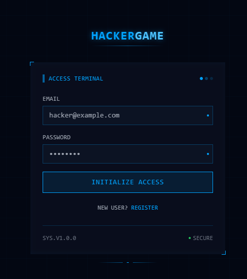
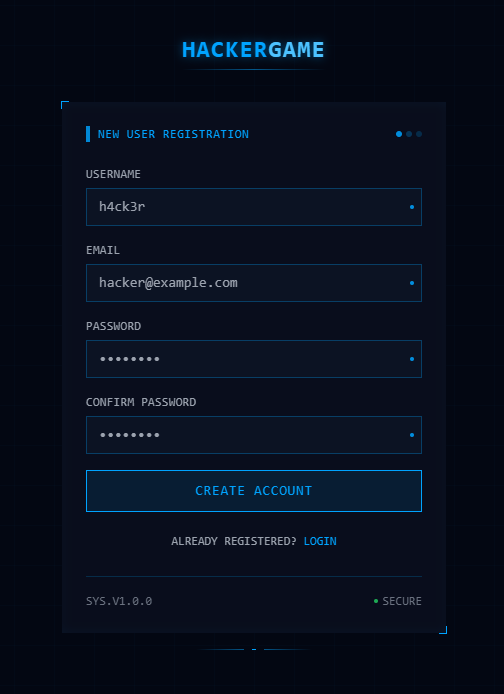
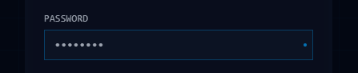
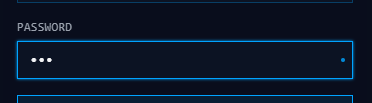
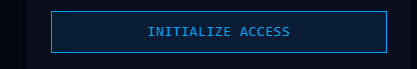
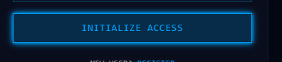
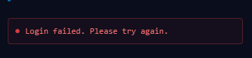
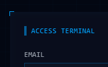
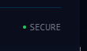

# Design System - Visual DNA

Esta guía define el ADN visual del Hacker Game. **Todos los componentes y páginas deben seguir estas directrices** para mantener la coherencia visual y la identidad del juego.

---

## 📸 Galería Visual

### Vista General del Sistema


*Página de Login - Vista completa mostrando grid de fondo, scan line, corner brackets y estructura general*


*Página de Register - Diseño idéntico al login con formulario extendido*

---

## 🎨 Filosofía de Diseño

### Concepto Core
**"Minimalista Cyber/HUD"** - Interfaz futurista tipo terminal de hacker, sin saturación visual. Cada elemento tiene un propósito funcional.

### Principios
1. **Menos es más** - Sin elementos decorativos innecesarios
2. **Funcionalidad primero** - Cada animación tiene feedback útil
3. **Coherencia visual** - Mismo lenguaje en toda la aplicación
4. **Performance** - Animaciones fluidas, sin lag

---

## 🎨 Paleta de Colores

### Colores Principales

```css
/* Cyber Cyan - Color identitario */
cyber-500: #00a3ff   /* Primario - acentos, bordes, textos importantes */
cyber-300: #4dc2ff   /* Secundario - variaciones */
cyber-700: #006199   /* Oscuro - estados hover */

/* Backgrounds Oscuros */
dark-950: #030712    /* Casi negro - fondo principal de pantalla */
dark-900: #0a0f1e    /* Fondo principal - containers */
dark-800: #0f172a    /* Cards, inputs, elementos elevados */

/* Textos */
gray-100: #f3f4f6    /* Texto principal */
gray-400: #9ca3af    /* Labels, texto secundario */
gray-500: #6b7280    /* Texto deshabilitado, footer */
```

### Estados y Feedback

```css
/* Éxito */
green-500: #10b981   /* Indicadores de estado OK */

/* Error */
red-500: #ef4444     /* Mensajes de error */
red-400: #f87171     /* Texto de error */

/* Warning */
yellow-500: #f59e0b  /* Advertencias */
```

---

## 📐 Tipografía

### Font Family
```css
font-family: 'Consolas', 'Monaco', 'Courier New', monospace;
```
**Regla:** Siempre usar `font-mono` (monospace). Todo el juego usa tipografía monoespaciada.

### Jerarquía de Tamaños

```css
/* Títulos principales */
text-2xl: 24px       /* Logo, títulos de página */

/* Subtítulos */
text-sm: 14px        /* Inputs, botones, contenido */

/* Labels y metadata */
text-xs: 12px        /* Labels de campos, footers, headers de sección */
```

### Text Styles

```css
/* Texto con glow (títulos importantes) */
.text-glow {
  text-shadow: 0 0 10px rgba(0, 163, 255, 0.5);
}

/* Texto con glow sutil */
.text-glow-sm {
  text-shadow: 0 0 5px rgba(0, 163, 255, 0.3);
}

/* Tracking (letter-spacing) */
tracking-wider         /* Para labels y textos en mayúsculas */
tracking-wide          /* Para títulos */
```

---

## 🔲 Componentes Base

### 1. Inputs


*Input en estado normal con punto pulsante indicador*


*Input en estado focus - borde cyan completo iluminado con shadow-neon-sm*

```tsx
<input
  className="
    w-full
    bg-dark-800/50
    border border-cyber-500/30
    focus:border-cyber-500
    text-sm text-gray-100
    px-3 py-2
    outline-none
    transition-all duration-300
    hover:border-cyber-500/50
    focus:shadow-neon-sm
  "
/>
```

**Características:**
- Fondo semi-transparente `dark-800/50`
- Borde sutil `cyber-500/30` que se ilumina en hover/focus
- Punto pulsante en la esquina derecha (indicador de actividad)

### 2. Botones Primarios


*Botón en estado normal con borde cyan*


*Botón en hover - efecto neon glow completo activado*

```tsx
<button
  className="
    w-full
    bg-cyber-500/10
    border border-cyber-500
    text-cyber-500
    py-2.5
    text-sm
    tracking-wider
    font-medium
    hover:bg-cyber-500/20
    hover:shadow-neon
    transition-all duration-300
    disabled:opacity-50
    disabled:cursor-not-allowed
    relative
    overflow-hidden
    group
  "
>
  <span className="relative z-10">TEXTO BOTÓN</span>
  <div className="
    absolute inset-0
    bg-gradient-to-r from-transparent via-cyber-500/10 to-transparent
    -translate-x-full group-hover:translate-x-full
    transition-transform duration-1000
  " />
</button>
```

**Características:**
- Fondo transparente con borde cyan
- Gradient sweep en hover (efecto de escaneo)
- Texto en mayúsculas con `tracking-wider`

### 3. Labels

```tsx
<label className="block text-xs text-gray-400 mb-1.5 tracking-wide">
  NOMBRE DEL CAMPO
</label>
```

**Reglas:**
- Siempre en mayúsculas
- Color `gray-400`
- Tamaño `text-xs`
- `tracking-wide` para legibilidad

### 4. Mensajes de Error


*Error feedback - borde rojo, fondo rojo/5, punto pulsante rojo*

```tsx
<div className="border border-red-500/30 bg-red-500/5 text-red-400 text-xs p-2.5 rounded">
  <div className="flex items-center gap-2">
    <div className="w-1.5 h-1.5 bg-red-500 rounded-full animate-pulse" />
    <span>Mensaje de error aquí</span>
  </div>
</div>
```

---

## ✨ Efectos y Animaciones

### 1. Corner Brackets (Esquinas Decorativas)


*Corner brackets visibles en las esquinas del container principal*

```tsx
<div className="corner-brackets">
  {/* Contenido */}
</div>
```

**Uso:** Containers importantes (login, modales, cards destacados)

### 2. HUD Border (Borde con Glow)

```tsx
<div className="hud-border">
  {/* Contenido */}
</div>
```

**Uso:** Elementos interactivos, cards que responden a hover

### 3. Scan Line (Línea de Escaneo)

```tsx
<div className="absolute inset-0 pointer-events-none overflow-hidden">
  <div className="absolute w-full h-px bg-gradient-to-r from-transparent via-cyber-500/30 to-transparent animate-scan" />
</div>
```

**Uso:** Fondos de pantallas principales (login, dashboard)

### 4. Puntos Pulsantes (Activity Indicators)


*Tres puntos pulsantes con delays escalonados - indicador de actividad*

```tsx
{/* Grupo de 3 puntos */}
<div className="flex gap-1">
  <div className="w-1.5 h-1.5 rounded-full bg-cyber-500 animate-pulse" />
  <div className="w-1.5 h-1.5 rounded-full bg-cyber-500/50 animate-pulse"
       style={{ animationDelay: '0.5s' }} />
  <div className="w-1.5 h-1.5 rounded-full bg-cyber-500/30 animate-pulse"
       style={{ animationDelay: '1s' }} />
</div>
```

**Uso:** Headers, indicadores de estado activo

### 5. Barra Lateral Vertical (Accent)


*Barra vertical cyan pulsante - marcador de sección activa*

```tsx
<div className="w-1 h-4 bg-cyber-500 animate-pulse-slow" />
```

**Uso:** Headers de secciones, navegación activa

---

## 🎬 Animaciones Estándar

### Velocidades

```css
duration-300    /* Transiciones rápidas (hover, focus) */
duration-500    /* Transiciones medias (fade in/out) */
duration-1000   /* Animaciones largas (gradient sweep) */
```

### Secuencia de Entrada (Entry Animation)

**Patrón para páginas principales:**

```tsx
const [showLine, setShowLine] = useState(false);
const [showBox, setShowBox] = useState(false);
const [showContent, setShowContent] = useState(false);

useEffect(() => {
  const timer1 = setTimeout(() => setShowLine(true), 100);
  const timer2 = setTimeout(() => setShowBox(true), 600);
  const timer3 = setTimeout(() => setShowContent(true), 1100);

  return () => {
    clearTimeout(timer1);
    clearTimeout(timer2);
    clearTimeout(timer3);
  };
}, []);
```

**Orden:**
1. Línea superior se dibuja (100ms)
2. Box completo se dibuja (600ms)
3. Contenido aparece (1100ms)

---

## 🖼️ Layouts

### Pantalla Completa con Grid de Fondo


*Grid de fondo con líneas cyan sutiles - patrón 40x40px*

```tsx
<div className="min-h-screen flex items-center justify-center p-4 relative overflow-hidden">
  {/* Grid animado de fondo */}
  <div className="absolute inset-0 opacity-20">
    <div className="absolute inset-0"
      style={{
        backgroundImage: `
          linear-gradient(to right, rgba(0, 163, 255, 0.1) 1px, transparent 1px),
          linear-gradient(to bottom, rgba(0, 163, 255, 0.1) 1px, transparent 1px)
        `,
        backgroundSize: '40px 40px'
      }}
    />
  </div>

  {/* Scan line */}
  <div className="absolute inset-0 pointer-events-none overflow-hidden">
    <div className="absolute w-full h-px bg-gradient-to-r from-transparent via-cyber-500/30 to-transparent animate-scan" />
  </div>

  {/* Contenido */}
  <div className="relative w-full max-w-sm">
    {/* Tu contenido aquí */}
  </div>
</div>
```

### Container Card

```tsx
<div className="corner-brackets bg-dark-900/80 backdrop-blur-sm">
  <div className="p-6">
    {/* Contenido */}
  </div>
</div>
```

### Header de Sección


*Header con barra lateral, título en mayúsculas y puntos pulsantes*

```tsx
<div className="flex items-center justify-between mb-6">
  <div className="flex items-center gap-2">
    <div className="w-1 h-4 bg-cyber-500 animate-pulse-slow" />
    <span className="text-xs text-cyber-500 tracking-wider">TÍTULO SECCIÓN</span>
  </div>
  <div className="flex gap-1">
    {/* Puntos pulsantes */}
  </div>
</div>
```

### Footer Estándar


*Footer con versión del sistema e indicador de seguridad verde*

```tsx
<div className="mt-6 pt-4 border-t border-cyber-500/20">
  <div className="flex items-center justify-between text-xs text-gray-500">
    <span>SYS.V1.0.0</span>
    <div className="flex items-center gap-1">
      <div className="w-1 h-1 bg-green-500 rounded-full animate-pulse" />
      <span>SECURE</span>
    </div>
  </div>
</div>
```

---

## 🎯 Reglas de Uso

### DO ✅

1. **Usar siempre monospace** - `font-mono` en todo
2. **Mayúsculas para labels y títulos** - Estética terminal
3. **Animaciones sutiles** - Menos de 1 segundo
4. **Feedback visual** - Puntos pulsantes, glows en interacciones
5. **Espaciado consistente** - `gap-2`, `mb-4`, `p-6`
6. **Transparencias** - Fondos con `/50`, `/80` para depth
7. **Bordes sutiles** - `border-cyber-500/30` por defecto

### DON'T ❌

1. **No usar colores fuera de la paleta**
2. **No usar tipografía sans-serif o serif**
3. **No sobrecargar con animaciones**
4. **No usar sombras sólidas** - Solo neon/glow
5. **No usar bordes gruesos** - Máximo 1px
6. **No usar backgrounds sólidos 100%** - Siempre transparencias
7. **No usar rounded excesivo** - Máximo `rounded` (4px)

---

## 📦 Componentes Reutilizables

### Título de Página

```tsx
<div className="text-center mb-8">
  <div className="inline-block">
    <h1 className="text-2xl font-bold text-cyber-500 text-glow tracking-wider mb-1">
      HACKER<span className="text-cyber-300">GAME</span>
    </h1>
    <div className="h-px bg-gradient-to-r from-transparent via-cyber-500/50 to-transparent" />
  </div>
</div>
```

### Elemento Decorativo Inferior

```tsx
<div className="mt-4 flex justify-center">
  <div className="flex gap-2">
    <div className="w-12 h-px bg-gradient-to-r from-transparent to-cyber-500/50" />
    <div className="w-1 h-px bg-cyber-500" />
    <div className="w-12 h-px bg-gradient-to-l from-transparent to-cyber-500/50" />
  </div>
</div>
```

### Loading Indicator

```tsx
<div className="flex items-center gap-2">
  <div className="w-1 h-1 bg-cyber-500 rounded-full animate-pulse" />
  <span className="text-xs text-gray-400">LOADING...</span>
</div>
```

---

## 🔧 Tailwind Config Required

**Asegurate de tener estos valores en `tailwind.config.js`:**

```js
colors: {
  cyber: {
    300: '#4dc2ff',
    500: '#00a3ff',
    700: '#006199',
  },
  dark: {
    950: '#030712',
    900: '#0a0f1e',
    800: '#0f172a',
  }
},
boxShadow: {
  'neon': '0 0 5px theme("colors.cyber.500"), 0 0 10px theme("colors.cyber.500")',
  'neon-sm': '0 0 3px theme("colors.cyber.500")',
},
animation: {
  'pulse-slow': 'pulse 3s cubic-bezier(0.4, 0, 0.6, 1) infinite',
  'scan': 'scan 2s linear infinite',
  'draw-line': 'drawLine 0.5s ease-out forwards',
  'draw-vertical': 'drawVertical 0.5s ease-out forwards',
}
```

---

## 📝 Checklist para Nuevos Componentes

Antes de considerar un componente completo, verificá:

- [ ] Usa `font-mono`
- [ ] Paleta de colores cyber (cyan + dark)
- [ ] Labels en mayúsculas con `tracking-wide/wider`
- [ ] Inputs tienen punto pulsante indicador
- [ ] Botones tienen gradient sweep en hover
- [ ] Animaciones son sutiles y rápidas (< 1s)
- [ ] Usa transparencias en fondos (`/50`, `/80`)
- [ ] Bordes sutiles con opacidad (`/30`, `/50`)
- [ ] Estados hover/focus bien definidos
- [ ] Feedback visual en interacciones

---

## 🎨 Ejemplos de Referencia

**Ver implementaciones completas en:**
- `frontend-game/src/pages/Login.tsx` - Patrón de entrada animada
- `frontend-game/src/pages/Register.tsx` - Form con validación
- `frontend-game/src/index.css` - Custom components (corner-brackets, hud-border)

---

**Última actualización:** 2025-10-10
**Versión del sistema:** 1.0.0
