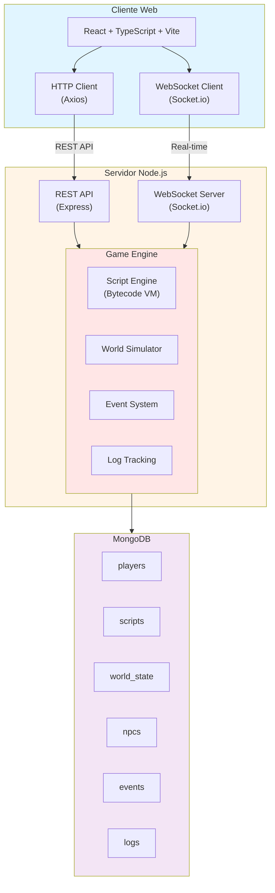
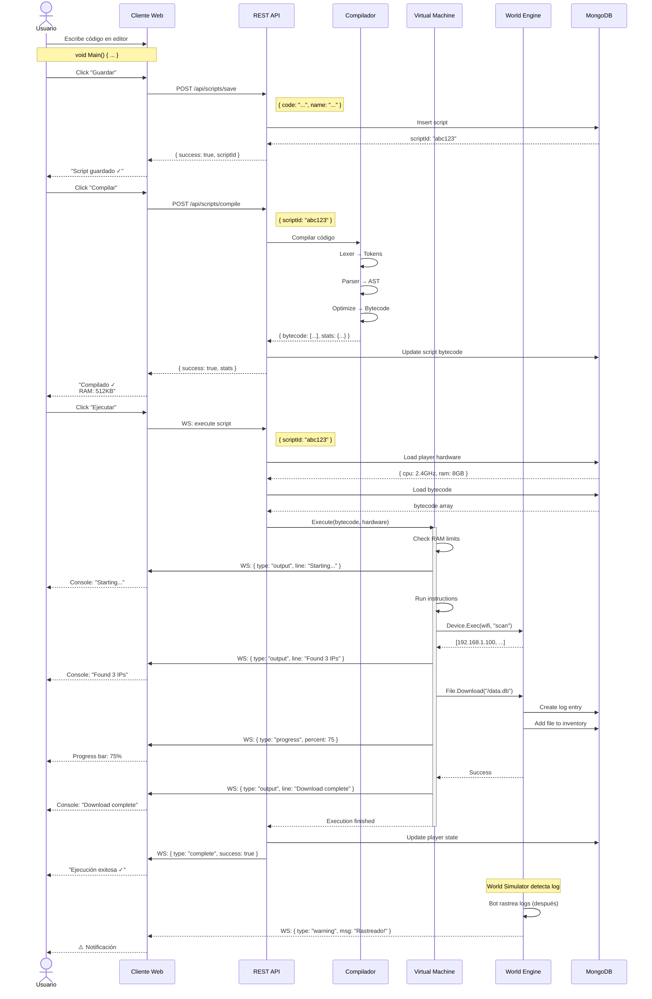

# Arquitectura del Juego - Hacker Simulator

## Visión General

Arquitectura **Cliente-Servidor Híbrida** con:
- **HTTP REST API** para operaciones stateless (comandos, queries)
- **WebSocket** para eventos en tiempo real (mundo, notificaciones)



---

## Comunicación HTTP REST API

### Endpoints Principales:

#### Autenticación
```
POST   /api/auth/register
POST   /api/auth/login
POST   /api/auth/logout
GET    /api/auth/me
```

#### Scripts
```
POST   /api/scripts/compile       # Compilar código a bytecode
POST   /api/scripts/save          # Guardar script
GET    /api/scripts/:id           # Obtener script
GET    /api/scripts               # Listar mis scripts
DELETE /api/scripts/:id           # Eliminar script
POST   /api/scripts/:id/execute   # Ejecutar script
```

#### Mundo
```
GET    /api/world/state           # Estado actual del mundo
GET    /api/world/npcs            # Lista de NPCs/empresas
GET    /api/world/targets         # Objetivos disponibles
```

#### Jugador
```
GET    /api/player/profile        # Mi perfil
GET    /api/player/hardware       # Mi hardware actual
POST   /api/player/hardware/buy   # Comprar hardware
GET    /api/player/inventory      # Mis archivos/datos robados
GET    /api/player/bank           # Estado bancario
```

#### Marketplace
```
GET    /api/market/hardware       # Hardware disponible
GET    /api/market/data           # Vender datos robados
POST   /api/market/sell           # Vender items
```

### Flujo de Compilación y Ejecución:



---

```javascript
// 1. Compilar Script
POST /api/scripts/compile
Request:
{
  "code": "void Main() { ... }",
  "name": "hack_bank_v1"
}

Response:
{
  "success": true,
  "scriptId": "abc123",
  "bytecode": [/* compiled bytecode */],
  "errors": [],
  "warnings": [],
  "stats": {
    "size": 256,        // bytes de bytecode
    "ramRequired": 512, // RAM necesaria
    "complexity": 3     // nivel de complejidad
  }
}

// 2. Ejecutar Script
POST /api/scripts/abc123/execute
Request:
{
  "params": []
}

Response:
{
  "success": true,
  "executionId": "exec_xyz",
  "output": "Scanning 192.168.1.100...\nFound 3 open ports...",
  "worldChanges": {
    "filesDownloaded": ["/etc/passwd"],
    "logsCreated": [
      {
        "serverId": "target_server",
        "path": "/var/log/auth.log",
        "entry": "Connection from 192.168.1.50"
      }
    ]
  },
  "playerChanges": {
    "bankBalance": -100,  // costo de operación
    "inventory": {
      "add": ["passwd_file"]
    }
  },
  "executionTime": 1523  // ms (afectado por CPU)
}
```

---

## Comunicación WebSocket

### Eventos del Servidor → Cliente:

```javascript
// Conexión
ws.on('connect', () => {
  ws.emit('authenticate', { token: 'JWT_TOKEN' })
})

// Eventos del mundo
ws.on('worldEvent', (event) => {
  /*
  {
    type: 'npc_action',
    data: {
      npcId: 'techcorp',
      action: 'opened_new_office',
      description: 'TechCorp abrió nueva oficina en Silicon Valley'
    }
  }
  */
})

// Notificaciones personales
ws.on('notification', (notification) => {
  /*
  {
    type: 'warning',
    severity: 'high',
    message: '⚠️ Fuiste rastreado! Los logs apuntan a tu IP',
    data: {
      sourceServer: 'bank_server',
      timeRemaining: 300  // segundos para borrar huellas
    }
  }
  */
})

// Cambios en tu estado
ws.on('playerUpdate', (update) => {
  /*
  {
    type: 'bank_frozen',
    data: {
      reason: 'Detected illegal activity',
      duration: 3600  // segundos
    }
  }
  */
})

// Script ejecutándose en background
ws.on('scriptProgress', (progress) => {
  /*
  {
    executionId: 'exec_xyz',
    progress: 45,  // porcentaje
    currentStep: 'Cracking password...'
  }
  */
})
```

### Eventos del Cliente → Servidor:

```javascript
// Subscribirse a eventos específicos
ws.emit('subscribe', {
  channels: ['world', 'notifications', 'player']
})

// Ping para mantener viva la conexión
setInterval(() => {
  ws.emit('ping')
}, 30000)
```

---

## Motor de Bytecode

### Pipeline de Compilación:

```
Código C#          →  Lexer  →  Parser  →  Compiler  →  Bytecode
"void Main() {}"       Tokens     AST        Optimize      [0x42, ...]
```

### Set de Instrucciones (Opcodes):

```javascript
const OPCODES = {
  // Stack
  PUSH: 0x01,        // Push valor literal al stack
  POP: 0x02,         // Pop del stack
  DUP: 0x03,         // Duplicar top of stack

  // Variables
  STORE_LOCAL: 0x10, // Guardar en variable local
  LOAD_LOCAL: 0x11,  // Cargar variable local
  STORE_GLOBAL: 0x12,// Variable global
  LOAD_GLOBAL: 0x13, // Cargar global

  // Aritmética
  ADD: 0x20,
  SUB: 0x21,
  MUL: 0x22,
  DIV: 0x23,
  MOD: 0x24,

  // Comparación
  EQ: 0x30,          // ==
  NEQ: 0x31,         // !=
  LT: 0x32,          // <
  LTE: 0x33,         // <=
  GT: 0x34,          // >
  GTE: 0x35,         // >=

  // Lógica
  AND: 0x40,
  OR: 0x41,
  NOT: 0x42,

  // Control de flujo
  JUMP: 0x50,        // Salto incondicional
  JUMP_IF_FALSE: 0x51,
  JUMP_IF_TRUE: 0x52,
  CALL: 0x53,        // Llamar función
  RETURN: 0x54,      // Retornar

  // Built-ins del juego
  BUILTIN_CALL: 0x60,// Llamar función built-in

  // Arrays
  ARRAY_NEW: 0x70,
  ARRAY_GET: 0x71,
  ARRAY_SET: 0x72,
  ARRAY_LEN: 0x73,

  // Strings
  STR_CONCAT: 0x80,
  STR_LEN: 0x81,
};
```

### Ejemplo de Compilación:

```csharp
// Código fuente
void Main() {
    int x = 5 + 10;
    Console.Log(x);
}

// Bytecode generado
[
  // int x = 5 + 10
  { op: PUSH, value: 5 },           // Push 5
  { op: PUSH, value: 10 },          // Push 10
  { op: ADD },                      // 5 + 10 = 15
  { op: STORE_LOCAL, name: 'x' },   // x = 15

  // Console.Log(x)
  { op: LOAD_LOCAL, name: 'x' },    // Cargar x
  { op: BUILTIN_CALL,
    module: 'Console',
    method: 'Log',
    argCount: 1
  },

  { op: RETURN }
]
```

### VM (Virtual Machine):

```javascript
class VirtualMachine {
  constructor(bytecode, playerHardware) {
    this.bytecode = bytecode;
    this.stack = [];
    this.locals = {};
    this.globals = {};
    this.pc = 0;  // Program counter
    this.hardware = playerHardware;
  }

  execute() {
    const startTime = Date.now();
    let instructionCount = 0;
    const maxInstructions = this.calculateMaxInstructions();

    while (this.pc < this.bytecode.length) {
      const instruction = this.bytecode[this.pc];

      // Límite de instrucciones (RAM)
      if (++instructionCount > maxInstructions) {
        throw new Error('Out of memory');
      }

      // Ejecutar instrucción
      this.executeInstruction(instruction);

      // Delay por CPU (simular velocidad)
      this.applyCPUDelay();

      this.pc++;
    }

    return {
      executionTime: Date.now() - startTime,
      instructionCount
    };
  }

  calculateMaxInstructions() {
    // Más RAM = más instrucciones permitidas
    return this.hardware.ram * 1000;
  }

  applyCPUDelay() {
    // CPU más rápida = menos delay
    const delayMs = 1000 / this.hardware.cpu.speed;
    // En producción, esto sería async
  }

  executeInstruction(instr) {
    switch(instr.op) {
      case OPCODES.PUSH:
        this.stack.push(instr.value);
        break;

      case OPCODES.ADD:
        const b = this.stack.pop();
        const a = this.stack.pop();
        this.stack.push(a + b);
        break;

      case OPCODES.STORE_LOCAL:
        this.locals[instr.name] = this.stack.pop();
        break;

      case OPCODES.BUILTIN_CALL:
        this.callBuiltin(instr);
        break;

      // ... más instrucciones
    }
  }

  callBuiltin(instr) {
    const args = [];
    for (let i = 0; i < instr.argCount; i++) {
      args.unshift(this.stack.pop());
    }

    const result = this.builtins[instr.module][instr.method](...args);
    if (result !== undefined) {
      this.stack.push(result);
    }
  }
}
```

---

## Simulación del Mundo

### World Simulator Loop:

```javascript
class WorldSimulator {
  constructor() {
    this.npcs = [];
    this.events = [];
    this.tickRate = 1000; // 1 segundo por tick
  }

  start() {
    setInterval(() => {
      this.tick();
    }, this.tickRate);
  }

  tick() {
    // 1. Procesar logs expirando
    this.processLogExpiration();

    // 2. Bots rastreando logs
    this.runTrackerBots();

    // 3. NPCs actuando
    this.updateNPCs();

    // 4. Generar eventos aleatorios
    this.generateRandomEvents();

    // 5. Actualizar economía
    this.updateEconomy();

    // 6. Notificar jugadores (via WebSocket)
    this.notifyPlayers();
  }

  processLogExpiration() {
    const expiredLogs = db.logs.find({
      expiresAt: { $lt: Date.now() }
    });

    db.logs.deleteMany({
      _id: { $in: expiredLogs.map(l => l._id) }
    });
  }

  runTrackerBots() {
    const servers = db.servers.find({ hasLogs: true });

    for (const server of servers) {
      const logs = db.logs.find({ serverId: server._id });

      // Bot intenta rastrear origen
      const traced = this.traceAttacker(logs);

      if (traced) {
        // Aplicar consecuencias
        this.applyConsequences(traced.playerId, traced.severity);

        // Notificar al jugador
        this.notifyPlayer(traced.playerId, {
          type: 'traced',
          severity: traced.severity,
          source: server.name
        });
      }
    }
  }

  updateNPCs() {
    for (const npc of this.npcs) {
      const action = npc.decideAction();

      if (action) {
        this.executeNPCAction(npc, action);

        // Broadcast evento
        this.broadcastEvent({
          type: 'npc_action',
          npc: npc.name,
          action: action.type,
          description: action.description
        });
      }
    }
  }

  generateRandomEvents() {
    if (Math.random() < 0.1) { // 10% chance por tick
      const event = this.createRandomEvent();
      this.events.push(event);

      this.broadcastEvent({
        type: 'world_event',
        event
      });
    }
  }

  broadcastEvent(event) {
    // Enviar a todos los clientes conectados via WebSocket
    io.emit('worldEvent', event);
  }
}
```

---

## Base de Datos (MongoDB)

### Collections:

#### players
```javascript
{
  _id: ObjectId,
  username: String,
  email: String,
  passwordHash: String,
  createdAt: Date,

  // Estado del juego
  hardware: {
    cpu: { model: String, speed: Number },
    ram: Number,  // MB
    disk: Number, // GB
    gpu: { model: String, power: Number },
    network: { speed: Number, ping: Number }
  },

  bankAccount: {
    balance: Number,
    frozen: Boolean,
    frozenUntil: Date
  },

  inventory: {
    scripts: [ObjectId],
    files: [{
      name: String,
      size: Number,
      stolenFrom: String,
      value: Number
    }]
  },

  stats: {
    successfulHacks: Number,
    timesCaught: Number,
    reputation: Number
  }
}
```

#### scripts
```javascript
{
  _id: ObjectId,
  playerId: ObjectId,
  name: String,
  sourceCode: String,
  bytecode: [Object],

  stats: {
    size: Number,
    ramRequired: Number,
    complexity: Number
  },

  createdAt: Date,
  lastModified: Date,
  timesExecuted: Number
}
```

#### world_state
```javascript
{
  _id: ObjectId,
  timestamp: Date,

  npcs: [{
    id: String,
    type: String,  // 'corporation', 'bank', 'startup', etc.
    name: String,

    servers: [{
      ip: String,
      services: [String],
      securityLevel: Number,
      hasValuableData: Boolean
    }],

    state: {
      money: Number,
      securityBudget: Number,
      hackAttempts: Number
    }
  }],

  activeEvents: [{
    id: String,
    type: String,
    description: String,
    expiresAt: Date
  }]
}
```

#### logs
```javascript
{
  _id: ObjectId,
  serverId: String,
  path: String,  // "/var/log/auth.log"

  entries: [{
    timestamp: Date,
    sourceIP: String,
    action: String,
    playerId: ObjectId  // quien causó el log
  }],

  createdAt: Date,
  expiresAt: Date,
  processed: Boolean  // si el bot ya lo procesó
}
```

---

## Stack Tecnológico

### Frontend
- **React 18** + **TypeScript**
- **Vite** (build tool)
- **TailwindCSS** (styling)
- **Monaco Editor** (editor de código)
- **Socket.io-client** (WebSocket)
- **Axios** (HTTP client)
- **Zustand** o **Redux** (state management)

### Backend
- **Node.js 20+**
- **Express** (REST API)
- **Socket.io** (WebSocket)
- **MongoDB** + **Mongoose** (database)
- **JWT** (autenticación)
- **bcrypt** (passwords)

### DevOps
- **Docker** (containerización)
- **nginx** (reverse proxy)
- **PM2** (process manager)

---

## Seguridad

### Sandboxing del Script Engine
- Límite de instrucciones ejecutadas
- Timeout de ejecución
- No acceso a funciones peligrosas de Node.js
- Solo APIs del juego disponibles

### Autenticación
- JWT con expiración
- Refresh tokens
- Rate limiting en endpoints sensibles

### Validación
- Validar todo input del cliente
- Sanitizar código de scripts
- Verificar permisos antes de ejecutar

---

## Próximos Pasos

1. ✅ Arquitectura definida
2. ⏳ Definir API detallada (OpenAPI/Swagger)
3. ⏳ Implementar prototipo del Script Engine
4. ⏳ Crear base de datos inicial
5. ⏳ Desarrollar MVP frontend
6. ⏳ Implementar World Simulator básico
