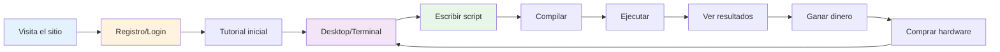

# Development Roadmap - Hacker Game

## Flujo del Usuario (User Journey)



---

## Roadmap por Fases

### 🎯 FASE 0: Setup Inicial (Fundación)

**Objetivo:** Tener la estructura base del proyecto

#### Backend Setup
- [ ] Crear carpeta `backend/`
- [ ] Inicializar proyecto Node.js (`npm init`)
- [ ] Instalar dependencias base:
  - [ ] Express
  - [ ] Mongoose (MongoDB)
  - [ ] JWT (jsonwebtoken)
  - [ ] bcrypt
  - [ ] dotenv
  - [ ] cors
- [ ] Configurar estructura de carpetas:
  ```
  backend/
  ├── src/
  │   ├── config/       # Configuraciones (DB, env)
  │   ├── models/       # Schemas de MongoDB
  │   ├── routes/       # API endpoints
  │   ├── controllers/  # Lógica de negocio
  │   ├── middleware/   # Auth, validation, etc
  │   └── server.js     # Entry point
  ├── .env.example
  ├── package.json
  └── README.md
  ```
- [ ] Configurar conexión a MongoDB
- [ ] Configurar variables de entorno

#### Frontend Setup
- [ ] Crear carpeta `frontend/`
- [ ] Inicializar proyecto Vite + React + TypeScript
- [ ] Instalar dependencias base:
  - [ ] React Router DOM
  - [ ] Axios
  - [ ] TailwindCSS
  - [ ] Socket.io-client (futuro)
- [ ] Configurar estructura de carpetas:
  ```
  frontend/
  ├── src/
  │   ├── components/   # Componentes reusables
  │   ├── pages/        # Páginas/vistas
  │   ├── contexts/     # React Context
  │   ├── services/     # API calls
  │   ├── utils/        # Helpers
  │   └── App.tsx
  ├── public/
  └── package.json
  ```
- [ ] Configurar Tailwind
- [ ] Crear layout base

---

### 🎯 FASE 1: Autenticación (MVP Mínimo)

**Objetivo:** Usuario puede registrarse y hacer login

#### Backend - Auth
- [ ] Crear modelo User (MongoDB schema)
  ```javascript
  {
    username: String,
    email: String,
    passwordHash: String,
    createdAt: Date
  }
  ```
- [ ] Endpoint: `POST /api/auth/register`
  - [ ] Validar datos
  - [ ] Hash password (bcrypt)
  - [ ] Crear usuario en DB
  - [ ] Retornar JWT
- [ ] Endpoint: `POST /api/auth/login`
  - [ ] Validar credenciales
  - [ ] Comparar password
  - [ ] Retornar JWT
- [ ] Endpoint: `GET /api/auth/me`
  - [ ] Middleware de autenticación
  - [ ] Retornar datos del usuario
- [ ] Middleware `authMiddleware` para proteger rutas

#### Frontend - Auth
- [ ] Página de Login (`/login`)
  - [ ] Form con email/password
  - [ ] Validación básica
  - [ ] Llamada a API
  - [ ] Guardar JWT en localStorage
- [ ] Página de Register (`/register`)
  - [ ] Form con username/email/password
  - [ ] Validación
  - [ ] Llamada a API
  - [ ] Redirect a login
- [ ] Context de autenticación
  - [ ] Estado global del usuario
  - [ ] Funciones login/logout/checkAuth
- [ ] ProtectedRoute component
  - [ ] Verificar si está autenticado
  - [ ] Redirect a login si no

**✅ Milestone 1:** Usuario puede registrarse, hacer login y ver su perfil

---

### 🎯 FASE 2: Perfil del Jugador (Game State)

**Objetivo:** Usuario tiene un perfil de juego con hardware inicial

#### Backend - Player Profile & Template System
- [ ] Crear **Template del Sistema** en MongoDB
  - [ ] Collection `system_templates`
  - [ ] Un documento con el filesystem inicial:
    ```javascript
    {
      templateId: "default_pc_v1",
      version: "1.0.0",

      hardware: {
        cpu: { model: "Intel Celeron", speed: 1.6 },
        ram: 2048,  // 2GB
        disk: 50000,  // 50GB
        gpu: { model: "Integrated", power: 1 },
        network: { speed: 10, ping: 50 }
      },

      filesystem: [
        // Archivos del sistema
        { path: "/bin/ls", type: "executable", content: { bytecode: [...] } },
        { path: "/bin/cat", type: "executable", content: { bytecode: [...] } },
        { path: "/bin/mv", type: "executable", content: { bytecode: [...] } },
        // ... más comandos

        // Tutorial y documentación
        { path: "/home/README.md", type: "text", content: { data: "# Bienvenido..." } },
        { path: "/home/TUTORIAL.md", type: "text", content: { data: "# Tutorial..." } },
        { path: "/home/COMMANDS.md", type: "text", content: { data: "# Comandos..." } },

        // Scripts de ejemplo
        { path: "/home/examples/hello.sc", type: "source", content: { sourceCode: "void Main() {...}" } },
        { path: "/home/examples/scan_example.sc", type: "source", content: { sourceCode: "..." } }
      ],

      initialBalance: 1000
    }
    ```

- [ ] Extender modelo User con datos del juego:
  ```javascript
  {
    // ... datos de auth

    // Template usado (para futuras migraciones)
    templateVersion: "1.0.0",

    // Datos del juego
    hardware: {
      cpu: { model: String, speed: Number },
      ram: Number,
      disk: Number,
      gpu: { model: String, power: Number },
      network: { speed: Number, ping: Number }
    },

    bankAccount: {
      balance: Number,
      frozen: Boolean
    },

    stats: {
      successfulHacks: Number,
      timesCaught: Number
    }
  }
  ```

- [ ] Función `initializePlayerFromTemplate(userId)` al registrarse
  - [ ] Leer template de DB
  - [ ] Copiar hardware al usuario
  - [ ] Copiar balance inicial
  - [ ] **Clonar filesystem**: crear archivos del template para el usuario
  - [ ] Guardar versión del template usado

- [ ] Endpoint: `GET /api/player/profile`
- [ ] Endpoint: `GET /api/player/hardware`
- [ ] Endpoint: `GET /api/player/inventory`

#### Frontend - Dashboard
- [ ] Página Dashboard (`/dashboard`)
  - [ ] Header con username y balance
  - [ ] Sidebar con navegación
  - [ ] Vista de hardware actual
  - [ ] Stats básicas
- [ ] Componente HardwareDisplay
  - [ ] Mostrar CPU, RAM, Disk, GPU
  - [ ] Iconos y styling

**✅ Milestone 2:** Usuario ve su perfil de juego y hardware

---

### 🎯 FASE 3: Terminal Básica (UI Core)

**Objetivo:** Interfaz de terminal funcional

#### Frontend - Terminal
- [ ] Componente Terminal
  - [ ] Input de comandos
  - [ ] Output/console log
  - [ ] Historial de comandos (↑↓)
  - [ ] Auto-scroll
  - [ ] Styling tipo terminal (monospace, tema oscuro)
- [ ] Sistema de comandos básico (mock)
  - [ ] `help` - Listar comandos disponibles
  - [ ] `clear` - Limpiar pantalla
  - [ ] `whoami` - Mostrar usuario
  - [ ] `status` - Mostrar hardware/stats
  - [ ] `echo <text>` - Imprimir texto
- [ ] Parser de comandos simple
  ```javascript
  function parseCommand(input) {
    const [cmd, ...args] = input.trim().split(' ');
    return { command: cmd, arguments: args };
  }
  ```

**✅ Milestone 3:** Terminal funcional con comandos básicos

---

### 🎯 FASE 4: Sistema de Archivos Virtual

**Objetivo:** Usuario tiene un filesystem donde guardar scripts

#### Backend - Filesystem & Computers
- [ ] Modelo Computer (MongoDB schema)
  ```javascript
  {
    _id: ObjectId,
    type: String,  // "player_pc" | "npc_server" | "router" | "bank_server" | etc.

    name: String,  // "Mi PC" | "TechCorp Server" | etc.
    ip: String,  // "192.168.1.100"

    hardware: {
      cpu: { model: String, speed: Number },
      ram: Number,
      disk: Number,
      gpu: { model: String, power: Number },
      network: { speed: Number }
    },

    // Cuentas de usuario en esta computadora
    accounts: [{
      username: String,
      passwordHash: String,
      permissions: String,  // "admin" | "user" | "root"
    }],

    // Info del propietario (NPC o nadie si es del jugador)
    npcOwner: ObjectId,  // null si es PC del jugador

    security: {
      hasFirewall: Boolean,
      encryptionLevel: Number,
      ports: [{
        number: Number,
        service: String,  // "ssh", "ftp", "http", etc.
        open: Boolean
      }]
    },

    createdAt: Date
  }
  ```

- [ ] Modelo File (MongoDB schema)
  ```javascript
  {
    computerId: ObjectId,  // ← ID de la computadora (no playerId)
    path: String,
    name: String,
    fileType: String,  // "source" | "executable" | "text" | "data"

    content: {
      sourceCode: String,    // Si es source
      bytecode: [Object],    // Si es executable
      data: String           // Si es text/data
    },

    permissions: {
      owner: String,   // "root" | "user" | etc.
      readable: Boolean,
      writable: Boolean,
      executable: Boolean
    },

    size: Number,
    createdAt: Date,
    modifiedAt: Date
  }
  ```

- [ ] Modelo PlayerAccess (conocer credenciales)
  ```javascript
  {
    playerId: ObjectId,
    computerId: ObjectId,

    // Credenciales conocidas
    username: String,
    password: String,  // Plain text (el jugador las conoce)

    // Estado de acceso
    hasRootAccess: Boolean,
    discoveredAt: Date
  }
  ```

- [ ] Función `createPlayerComputer()` al registrarse
  - [ ] Crear computadora nueva (sin owner, entidad independiente)
  - [ ] Crear cuenta "user" con password ÚNICA generada
  - [ ] IP única en el mundo del juego
  - [ ] Retornar computerId y credenciales

- [ ] Función `grantPlayerAccess(playerId, computerId, username, password)`
  - [ ] Crear registro en PlayerAccess
  - [ ] El jugador ahora "conoce" estas credenciales
  - [ ] **IMPORTANTE**: Otro jugador puede descubrir las mismas credenciales

- [ ] Al hacer login en el juego:
  - [ ] Buscar la "computadora inicial" del jugador (su PC)
  - [ ] Auto-conectar usando sus credenciales guardadas
  - [ ] Mostrar terminal de esa computadora

- [ ] Función `initializeFilesystem(computerId)`
  - [ ] Clonar filesystem del template a esta computadora
  - [ ] Crear estructura de directorios
  - [ ] Instalar scripts del sistema (/bin)

- [ ] Endpoint: `GET /api/files/list?computerId=xxx&path=/`
  - [ ] Listar archivos en directorio de esa computadora
- [ ] Endpoint: `GET /api/files/read?computerId=xxx&path=/home/file.txt`
  - [ ] Leer contenido de archivo
- [ ] Endpoint: `POST /api/files/write`
  - [ ] Crear/modificar archivo (validar permisos)
- [ ] Endpoint: `DELETE /api/files/delete?computerId=xxx&path=/home/file.txt`
  - [ ] Eliminar archivo

#### Frontend - File Commands
- [ ] Comando `ls [path]`
  - [ ] Llamada a `/api/files/list`
  - [ ] Mostrar lista de archivos
- [ ] Comando `cat <file>`
  - [ ] Llamada a `/api/files/read`
  - [ ] Mostrar contenido
  - [ ] Si es binario, mostrar "basura"
- [ ] Comando `mkdir <dir>`
  - [ ] Crear directorio
- [ ] Comando `rm <file>`
  - [ ] Eliminar archivo

**✅ Milestone 4:** Sistema de archivos funcional

---

### 🎯 FASE 5: Editor de Código

**Objetivo:** Usuario puede crear y editar scripts

#### Frontend - Code Editor
- [ ] Instalar Monaco Editor
  ```bash
  npm install @monaco-editor/react
  ```
- [ ] Componente CodeEditor
  - [ ] Monaco configurado con tema oscuro
  - [ ] Syntax highlighting para tu lenguaje (custom)
  - [ ] Save/Close buttons
- [ ] Comando `edit <file>`
  - [ ] Abrir modal/vista con editor
  - [ ] Cargar contenido si existe
  - [ ] Guardar al hacer save
- [ ] Comando `nano <file>` (alternativa simple)
  - [ ] Editor básico en terminal

#### Backend - Save Scripts
- [ ] Ya está cubierto con `/api/files/write`

**✅ Milestone 5:** Usuario puede escribir scripts en el editor

---

### 🎯 FASE 6: Compilador (Script Engine - Parte 1)

**Objetivo:** Compilar scripts a bytecode

#### Backend - Compiler
- [ ] Crear carpeta `backend/src/compiler/`
- [ ] Implementar Lexer
  - [ ] Tokenizar código fuente
  - [ ] Reconocer keywords: void, int, string, if, for, return, etc.
  - [ ] Reconocer operadores: +, -, *, /, =, ==, etc.
  - [ ] Reconocer literales: números, strings
- [ ] Implementar Parser
  - [ ] Generar AST desde tokens
  - [ ] Validar sintaxis
  - [ ] Reportar errores con línea/columna
- [ ] Implementar Compiler (AST → Bytecode)
  - [ ] Definir set de opcodes
  - [ ] Generar bytecode desde AST
  - [ ] Calcular stats (RAM required, size, etc.)
- [ ] Endpoint: `POST /api/scripts/compile`
  ```javascript
  Request: { code: "void Main() { ... }" }
  Response: {
    success: true,
    bytecode: [...],
    stats: { size, ramRequired, complexity },
    errors: []
  }
  ```

#### Frontend - Compile Command
- [ ] Comando `compile <file.sc> -o <output>`
  - [ ] Leer archivo source
  - [ ] Enviar a `/api/scripts/compile`
  - [ ] Guardar bytecode en archivo
  - [ ] Mostrar stats

**✅ Milestone 6:** Usuario puede compilar scripts

---

### 🎯 FASE 7: Virtual Machine (Script Engine - Parte 2)

**Objetivo:** Ejecutar bytecode compilado

#### Backend - VM
- [ ] Crear carpeta `backend/src/vm/`
- [ ] Implementar VirtualMachine class
  - [ ] Stack
  - [ ] Variables (locals/globals)
  - [ ] Program counter
  - [ ] Ejecutar instrucciones
- [ ] Implementar instrucciones básicas:
  - [ ] PUSH, POP
  - [ ] STORE_LOCAL, LOAD_LOCAL
  - [ ] ADD, SUB, MUL, DIV
  - [ ] JUMP, JUMP_IF_FALSE
  - [ ] CALL, RETURN
- [ ] Implementar límites de hardware
  - [ ] Max instrucciones según RAM
  - [ ] Timeout según CPU
- [ ] Built-in: Console.Log()
  - [ ] Guardar output
  - [ ] Enviar via callback
- [ ] Endpoint: `POST /api/scripts/execute` (HTTP por ahora)
  ```javascript
  Request: {
    filePath: "/home/script.exe",
    args: []
  }
  Response: {
    success: true,
    output: "Hello World\nScript finished",
    executionTime: 125
  }
  ```

#### Frontend - Execute Command
- [ ] Comando `./script.exe` o `run script.exe`
  - [ ] Enviar a `/api/scripts/execute`
  - [ ] Mostrar output en terminal

**✅ Milestone 7:** Usuario puede ejecutar scripts compilados

---

### 🎯 FASE 8: Built-in APIs Básicas

**Objetivo:** Scripts pueden interactuar con el sistema

#### Backend - Built-ins
- [ ] Implementar File API (en VM)
  - [ ] `File.Read(path)`
  - [ ] `File.Write(path, content)`
  - [ ] `File.Delete(path)`
  - [ ] `File.List(path)`
  - [ ] `File.Exists(path)`
- [ ] Implementar Console API
  - [ ] `Console.Log(text)`
  - [ ] `Console.Error(text)`
- [ ] Validar permisos
  - [ ] Usuario solo puede acceder a sus archivos
  - [ ] No puede escribir en /bin (sistema)

#### Frontend
- [ ] Ya funciona con los comandos anteriores

**✅ Milestone 8:** Scripts pueden manipular archivos

---

### 🎯 FASE 9: Scripts del Sistema

**Objetivo:** Comandos de terminal son scripts ejecutables

#### Backend - System Scripts
- [ ] Crear scripts pre-compilados para:
  - [ ] `ls` - Listar archivos
  - [ ] `cat` - Mostrar contenido
  - [ ] `mv` - Mover archivo
  - [ ] `cp` - Copiar archivo
  - [ ] `rm` - Eliminar archivo
  - [ ] `mkdir` - Crear directorio
  - [ ] `pwd` - Current directory
  - [ ] `cd` - Cambiar directorio
  - [ ] `clear` - Limpiar terminal
  - [ ] `help` - Mostrar ayuda
- [ ] Función `initSystemScripts()`
  - [ ] Compilar scripts del sistema
  - [ ] Guardar en DB como readonly
  - [ ] Instalar en /bin de cada usuario

#### Frontend - Execute Any Command
- [ ] Modificar terminal para ejecutar cualquier archivo:
  ```javascript
  async function executeCommand(input) {
    const [cmd, ...args] = input.split(' ');

    // Buscar en /bin
    const scriptPath = `/bin/${cmd}`;

    // Ejecutar script
    await executeScript(scriptPath, args);
  }
  ```

**✅ Milestone 9:** Terminal funciona con scripts del sistema

---

### 🎯 FASE 10: WebSocket (Tiempo Real)

**Objetivo:** Ejecución de scripts en tiempo real

#### Backend - WebSocket
- [ ] Instalar Socket.io
  ```bash
  npm install socket.io
  ```
- [ ] Configurar Socket.io en server
  - [ ] Middleware de autenticación (JWT)
  - [ ] Eventos básicos (connect, disconnect)
- [ ] Modificar VM para emitir eventos
  ```javascript
  vm.on('output', (line) => {
    socket.emit('scriptOutput', { line });
  });

  vm.on('progress', (percent) => {
    socket.emit('scriptProgress', { percent });
  });

  vm.on('complete', (result) => {
    socket.emit('scriptComplete', result);
  });
  ```
- [ ] WebSocket event: `executeScript`
  - [ ] Recibir scriptPath y args
  - [ ] Ejecutar en VM
  - [ ] Emitir eventos durante ejecución

#### Frontend - WebSocket Client
- [ ] Instalar Socket.io client
  ```bash
  npm install socket.io-client
  ```
- [ ] Conectar al servidor
  - [ ] Con JWT token
- [ ] Escuchar eventos:
  - [ ] `scriptOutput` → Mostrar en terminal
  - [ ] `scriptProgress` → Actualizar progress bar
  - [ ] `scriptComplete` → Mostrar resultado
- [ ] Modificar ejecución para usar WebSocket

**✅ Milestone 10:** Ejecución en tiempo real funcional

---

### 🎯 FASE 11: Mundo Básico (NPCs)

**Objetivo:** Existen servidores/empresas para hackear

#### Backend - World State
- [ ] Modelo NPC/Server
  ```javascript
  {
    id: String,
    type: String,  // 'corporation', 'bank', etc.
    name: String,

    servers: [{
      ip: String,
      services: [{ port: Number, name: String }],
      securityLevel: Number,
      files: [{
        path: String,
        content: String,
        value: Number  // Cuánto vale si lo robas
      }]
    }],

    security: {
      hasFirewall: Boolean,
      encryptionLevel: Number
    }
  }
  ```
- [ ] Función `initializeWorld()`
  - [ ] Crear 5-10 NPCs básicos
  - [ ] Empresas pequeñas, medianas, banco
  - [ ] Cada uno con servidores vulnerables
- [ ] Endpoint: `GET /api/world/targets`
  - [ ] Listar NPCs disponibles

#### Frontend - Command: scan
- [ ] Mostrar lista de targets
- [ ] IP, nombre, tipo

**✅ Milestone 11:** Mundo básico con targets

---

### 🎯 FASE 12: Device API (Hackear Targets)

**Objetivo:** Scripts pueden conectarse a servidores externos

#### Backend - Device API
- [ ] Implementar `Device.Exec()` en VM
  ```javascript
  // Ejemplo en script:
  var result = Device.Exec(wifiMAC, "scan", []);
  ```
- [ ] Comandos de Device:
  - [ ] `scan` - Escanear red (retorna IPs)
  - [ ] `connect` - Conectar a IP/puerto
  - [ ] `exploit` - Intentar explotar vulnerabilidad
- [ ] Simular conexión a NPC
  - [ ] Verificar si existe el servidor
  - [ ] Crear log en el servidor target
  - [ ] Retornar info del servidor

#### Backend - Logs
- [ ] Modelo Log
  ```javascript
  {
    serverId: String,
    path: String,  // "/var/log/auth.log"

    entries: [{
      timestamp: Date,
      sourceIP: String,
      action: String,
      playerId: ObjectId
    }],

    expiresAt: Date,
    processed: Boolean
  }
  ```
- [ ] Crear logs al conectarse a servidores

#### Frontend
- [ ] Ya funciona con scripts

**✅ Milestone 12:** Hackear servidores básicos

---

### 🎯 FASE 13: Economía (Robar y Vender)

**Objetivo:** Usuario puede robar datos y vender por dinero

#### Backend - Steal & Sell
- [ ] Implementar `File.Download(remotePath, localPath)` desde servidores
  - [ ] Validar conexión activa
  - [ ] Copiar archivo a inventario del jugador
  - [ ] Registrar en log
- [ ] Endpoint: `POST /api/market/sell`
  - [ ] Recibir archivo del inventario
  - [ ] Calcular precio según valor
  - [ ] Añadir dinero al balance
  - [ ] Eliminar archivo del inventario
- [ ] Endpoint: `GET /api/market/prices`
  - [ ] Mostrar cuánto vale cada tipo de dato

#### Frontend - Commands
- [ ] Comando `sell <file>`
  - [ ] Llamar a API
  - [ ] Mostrar dinero ganado

**✅ Milestone 13:** Economía funcional

---

### 🎯 FASE 14: Comprar Hardware

**Objetivo:** Mejorar hardware con el dinero ganado

#### Backend - Shop
- [ ] Modelo Shop (productos)
  ```javascript
  {
    type: "cpu",
    model: "Intel i5",
    specs: { speed: 3.2 },
    price: 5000
  }
  ```
- [ ] Endpoint: `GET /api/shop/hardware`
  - [ ] Listar hardware disponible
- [ ] Endpoint: `POST /api/shop/buy`
  - [ ] Validar balance
  - [ ] Restar dinero
  - [ ] Actualizar hardware del jugador

#### Frontend - Shop UI
- [ ] Página Shop (`/shop`)
  - [ ] Lista de hardware
  - [ ] Botón comprar
- [ ] Comando `shop` en terminal
  - [ ] Abrir vista de shop

**✅ Milestone 14:** Sistema de upgrades funcional

---

### 🎯 FASE 15: Sistema de Rastreo

**Objetivo:** Consecuencias por no borrar logs

#### Backend - Tracker Bots
- [ ] World Simulator básico
  ```javascript
  setInterval(() => {
    runTrackerBots();
  }, 60000);  // Cada 1 minuto
  ```
- [ ] Función `runTrackerBots()`
  - [ ] Buscar logs sin procesar
  - [ ] Rastrear cadena de conexiones
  - [ ] Si llega al jugador → consecuencia
- [ ] Aplicar consecuencias
  - [ ] Congelar cuenta bancaria
  - [ ] Notificar al jugador

#### Frontend - Notifications
- [ ] WebSocket event: `notification`
  - [ ] Mostrar toast/alert
  - [ ] "⚠️ Fuiste rastreado!"

**✅ Milestone 15:** Sistema de riesgo funcional

---

### 🎯 FASE 16: Tutorial (In-Game)

**Objetivo:** Nuevos jugadores aprenden a jugar de forma inmersiva

#### Backend - Tutorial Files
- [ ] Crear archivos markdown pre-instalados en `/home/`
  - [ ] `README.md` - Bienvenida y primeros pasos
  - [ ] `TUTORIAL.md` - Tutorial completo paso a paso
  - [ ] `COMMANDS.md` - Lista de comandos disponibles
  - [ ] `EXAMPLES.md` - Scripts de ejemplo
- [ ] Instalar scripts de ejemplo en `/home/examples/`
  - [ ] `hello.sc` - Hello World básico
  - [ ] `scan_example.sc` - Cómo escanear la red
  - [ ] `hack_example.sc` - Primer hack simple

#### Contenido de Tutorial
```markdown
# Bienvenido, Hacker

Acabas de iniciar tu PC. Estás en tu terminal personal.

## Primeros Pasos

1. Escribe `ls` para ver tus archivos
2. Lee este tutorial completo: `cat TUTORIAL.md`
3. Explora los comandos: `cat COMMANDS.md`

## Tu Primera Misión

Tu objetivo es simple: hackear un servidor y robar datos para ganar dinero.

Sigue estos pasos:
1. Escanea la red: `./bin/scan`
2. Elige un objetivo fácil
3. Ejecuta un exploit
4. Roba archivos
5. ⚠️ IMPORTANTE: Borra tus logs
6. Vende los datos

Lee TUTORIAL.md para los detalles completos.

Buena suerte, y no te atrapen.

- El Sistema
```

**✅ Milestone 16:** Tutorial inmersivo in-game

---

## 🎯 MVP COMPLETO

Después de la Fase 16, tienes un **juego jugable** con:

✅ Autenticación
✅ Terminal funcional
✅ Sistema de archivos
✅ Editor de código
✅ Compilador y VM
✅ Scripts del sistema
✅ Mundo con NPCs
✅ Hackear servidores
✅ Robar y vender datos
✅ Comprar hardware
✅ Sistema de logs y rastreo
✅ Tutorial

---

## 🚀 FASES FUTURAS (Post-MVP)

### Fase 17+: Features Avanzadas
- [ ] Eventos mundiales dinámicos
- [ ] NPCs con IA (reaccionan a ataques)
- [ ] Multiplayer (ver otros jugadores)
- [ ] Chat
- [ ] Misiones/contratos
- [ ] Malware (crear virus, botnets)
- [ ] Sistema de reputación
- [ ] Dark web marketplace
- [ ] Herramientas de anonimato (VPN, proxies, Tor)
- [ ] Mini-juegos (cracking passwords con puzzles)
- [ ] Logros/achievements
- [ ] Leaderboards

---

## 📊 Estimación de Tiempo

| Fase | Descripción | Tiempo Estimado |
|------|-------------|-----------------|
| 0 | Setup | 2-4 horas |
| 1 | Auth | 1-2 días |
| 2 | Profile | 1 día |
| 3 | Terminal | 2-3 días |
| 4 | Filesystem | 2-3 días |
| 5 | Editor | 1-2 días |
| 6 | Compiler | 5-7 días ⚠️ |
| 7 | VM | 5-7 días ⚠️ |
| 8 | Built-ins | 2-3 días |
| 9 | System Scripts | 2-3 días |
| 10 | WebSocket | 2-3 días |
| 11 | World | 2-3 días |
| 12 | Device API | 3-4 días |
| 13 | Economy | 1-2 días |
| 14 | Shop | 2-3 días |
| 15 | Tracker | 2-3 días |
| 16 | Tutorial | 2-3 días |

**Total MVP:** ~6-8 semanas de desarrollo full-time

---

## 🎯 Priorización Sugerida

Si querés algo jugable **rápido**, podés hacer:

### Sprint 1 (Semana 1-2): Core
- Fase 0, 1, 2, 3 → Usuario puede loguearse y ver terminal

### Sprint 2 (Semana 3-4): Scripting Básico
- Fase 4, 5, 8 → Crear archivos, editarlos, comandos mock

### Sprint 3 (Semana 5-6): Engine
- Fase 6, 7 → Compilar y ejecutar scripts simples

### Sprint 4 (Semana 7-8): Gameplay
- Fase 11, 12, 13, 14 → Mundo, hackear, economía

### Sprint 5 (Semana 9-10): Polish
- Fase 9, 10, 15, 16 → Sistema completo, tiempo real, riesgo

---

## 📝 Notas

- Las **Fases 6 y 7** (Compiler + VM) son las más complejas
- Podés simplificar el lenguaje inicialmente (solo variables, if, loops)
- Los scripts del sistema (Fase 9) pueden ser mock al principio
- El World Simulator puede ser estático inicialmente
- WebSocket (Fase 10) es importante para UX pero no bloqueante

---

## ✅ Próximo Paso

¿Querés que empecemos con la **Fase 0: Setup Inicial**?

Puedo ayudarte a:
1. Crear la estructura de carpetas backend/frontend
2. Configurar package.json
3. Setup de MongoDB
4. Primer endpoint de prueba
